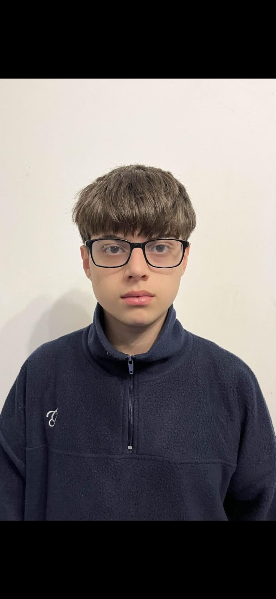
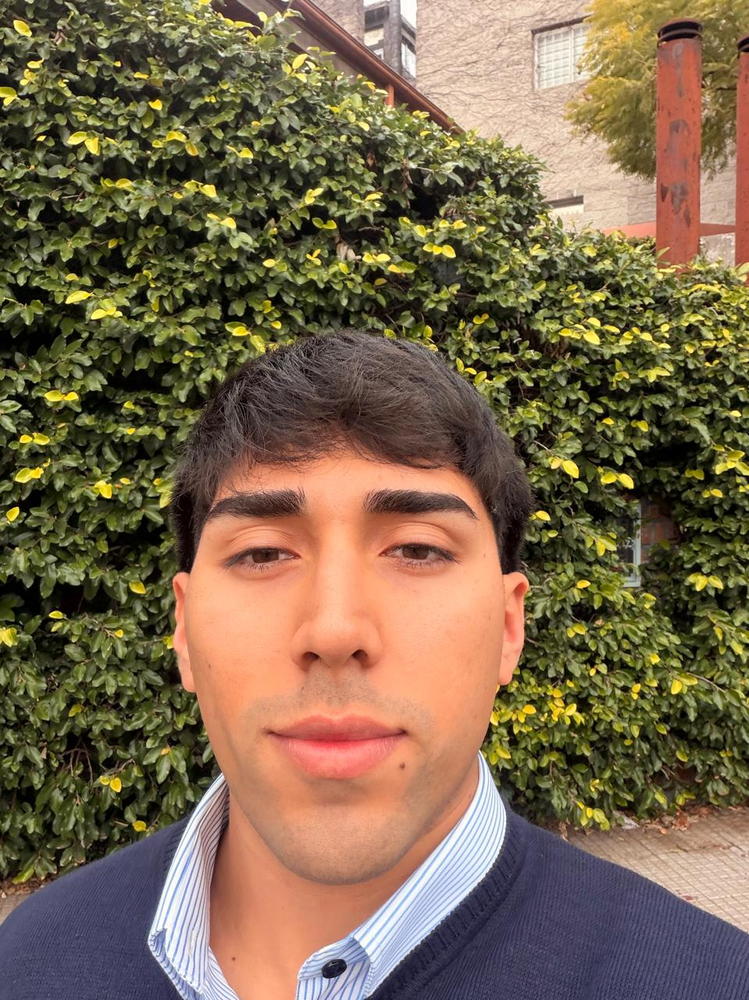

# Actividades-java

Integrantes:
- Julián Biscak 1207235

  Expectativas:
  - Aprender y profundizar conocimientos en Java para poder desempeñarnos como profesionales de la carrera

- Camila Albala 1215437

  Expectativas:
  - Espero de esta materia poder profundizar mis conocimientos en Java y aprender a programar de una forma más ordenada y profesional. También espero poder trabajar mejor en equipo, usar herramientas como GitHub y aplicar lo que aprendamos en proyectos más cercanos a situaciones reales
- Thiago Cura 1209523

  Expectativa:
  - Terminar la materia aprendiendo y saber un poco más de Java
- Federico Martinez 1128199

  Expectativa: 
    Entender mejor los conocimientos en Java, para poder desempeñarnos como profesionales
- Juan Ignacio Amalvy 1194254

Bitácora:
13/8 Creamos el archivo y nos presentamos
